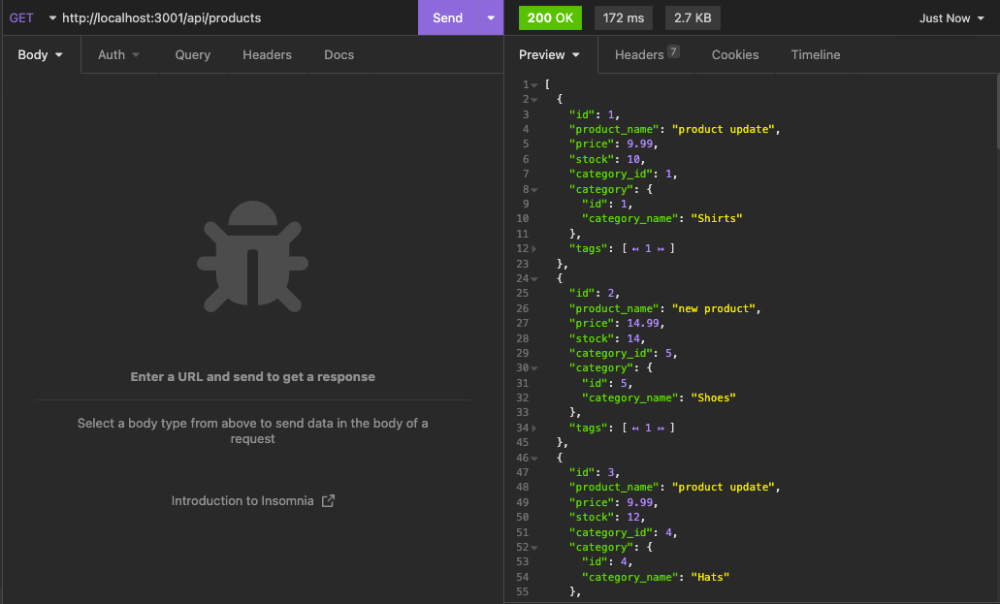
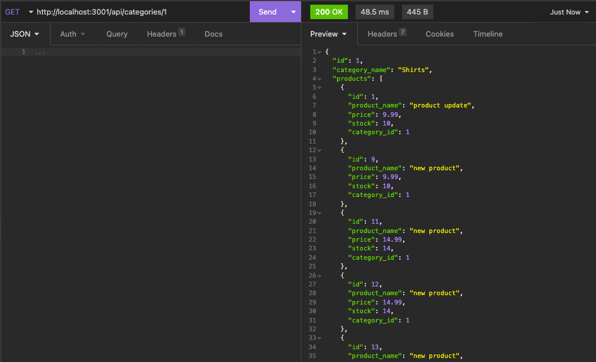
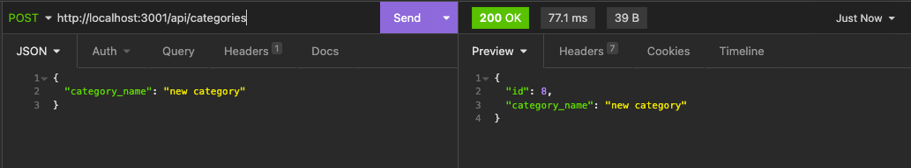

# E-Commerce Back End
[Installation Demo](./assets/installation-demo.webm)
<br>

[Insomnia Demo](https://drive.google.com/file/d/15xjPessrD95KpUySeCRJp5Sx5lKSknbR/view)

## Description
This application contains the back end code for an e-commerce website. The application calls on Express.js API to use Sequelize to interact with a MySQL database. It contains routes that allow users to GET, POST, PUT (update), and DELETE data.


[](https://opensource.org/licenses/MIT)

<br>

## Table of Contents

- [Installation](#installation)
- [Usage](#usage)
- [Technologies Used](#technologies-used)
- [License](#license)
- [Questions](#questions)

<br>

## Installation

To get started, users must initialize an installation of the required packages using the following command:

```
> npm install
```
Users should create an .env file with the following format, in order to encrypt their user and password information:
```
DB_NAME=ecommerce_db
DB_USER=''
DB_PASSWORD=''
```
Users should then navigate into the 'db' folder and add the database to their mysql shell:
```
> source schema.sql
```
Then the user will seed the provided data by running:

```
> npm run seed
```
<br>

## Usage
To start the server, the user will navigate to the root directory and run the following command:
```
> npm run start
```
To be able to interact with the various routes, it is suggested that the user uses the app Insomnia to create various request with the various routes.

Users have the ability to retrieve all data from a specific route:


<br>

Specific data from a specific route by referencing the ID of the data:


<br>

POST new or update existing data to specific routes:


<br>
And the ability to DELETE specific data by referenging the ID of the data. Be sure to watch the demo video linked at the top of the README to see a full demonstration of the routes being tested on Insomnia.

<br>

## Technologies Used:
* Github
* Node.js
* Express.js
* MySQL
* Sequelize
* JavaScript
* VS Code
* Insomnia (for testing)

<br>

## License
This application is covered under the MIT License

<br>

## Questions
https://github.com/overtonr
